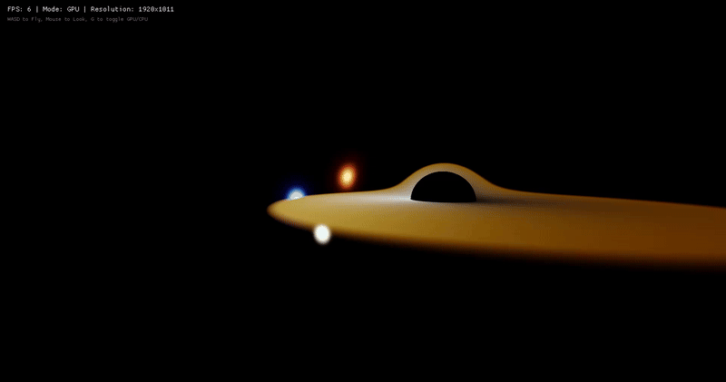

# **GPU-Accelerated Schwarzschild Black Hole Simulation**



A real-time, interactive Black Hole raytracer written in Rust. This project simulates the path of light beams (geodesics) in the curved spacetime around a Schwarzschild black hole.

Unlike standard rasterization, this engine uses **Relativistic Raymarching** to simulate what an observer would actually see near a black hole, including gravitational lensing, doppler beaming, and gravitational redshift.

It features a hybrid rendering engine:
1.  **GPU Mode (Default):** Uses `wgpu` and Compute Shaders (WGSL) for high-performance, real-time rendering.
2.  **CPU Mode:** A multi-threaded (Rayon) fallback that performs the exact same physics calculations on the CPU.

## **Features**

### **Physics Engine**
* **Hamiltonian Mechanics:** Solves the geodesic equations using Hamiltonian derivatives to accurately simulate light paths in curved spacetime.
* **Adaptive Time-Stepping:** Dynamically adjusts integration step sizes based on the distance to the Event Horizon to ensure precision without sacrificing performance.
* **Relativistic Optics:**
    * **Gravitational Redshift:** Light shifts color (Kelvin temperature) as it climbs out of the gravity well.
    * **Doppler Beaming:** The accretion disk appears significantly brighter and bluer on the side moving towards the observer ($I \propto \delta^4$).

### **Visualization**
* **Volumetric Accretion Disk:** Procedurally generated volumetric density profile representing hot plasma.
* **Procedural Skybox:** A generated background of stars and nebulae to visualize gravitational lensing (Einstein Rings).
* **Bloom & Tone Mapping:** HDR rendering pipeline to simulate the blinding intensity of the photon sphere and disk.

## **Installation & Running**

Ensure you have [Rust and Cargo installed](https://rustup.rs/).

1.  **Clone the repository:**
    ```bash
    git clone [https://github.com/LouisCleriot/BlackHoleSim.git](https://github.com/LouisCleriot/BlackHoleSim.git)
    cd BlackHoleSim
    ```

2.  **Run with optimizations:**
    ```bash
    cargo run --release
    ```

## **Controls**

The simulation starts in **FPV Mode** using the **GPU** backend.

| Key / Input | Action |
|-------------|--------|
| **WASD** | Fly / Move Camera |
| **Q / E** | Move Up / Down |
| **Shift** | Move Faster (Sprint) |
| **Mouse** | Look Around |
| **Space** | Pause / Resume Time |
| **G** | **Toggle GPU / CPU Rendering** |
| **R** | Reset Camera Position |

## **The Physics**

The simulation solves the equations of motion for a massless particle (photon) in a Schwarzschild metric. The engine utilizes a **Cartesian Hamiltonian** approach to integrate the state vectors $(x, p)$ over time:

1.  **The Photon Sphere:** The unstable orbit at $1.5 R_s$ where light can orbit indefinitely.
2.  **The Event Horizon:** The point of no return at $R_s$.
3.  **Lensing:** The extreme bending of background starlight around the shadow.

## **Dependencies**

* **macroquad:** Windowing, input, and texture display.
* **wgpu:** WebGPU/Vulkan backend for Compute Shaders.
* **rayon:** Parallel threading for the CPU fallback mode.
* **bytemuck:** GPU buffer data casting.

## **License**

MIT